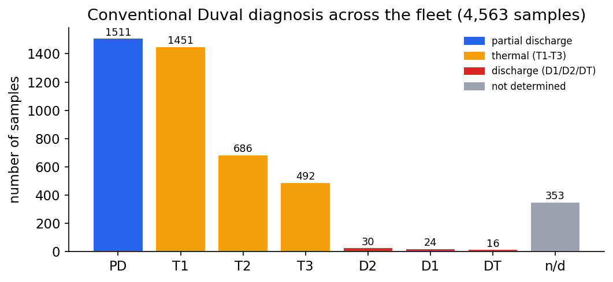
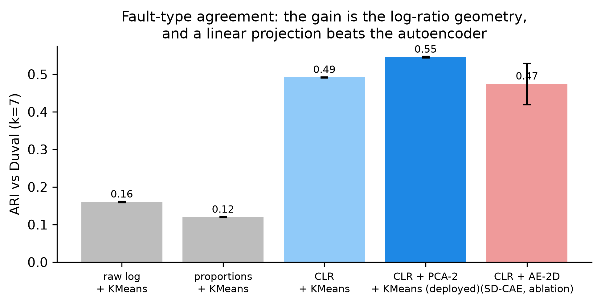
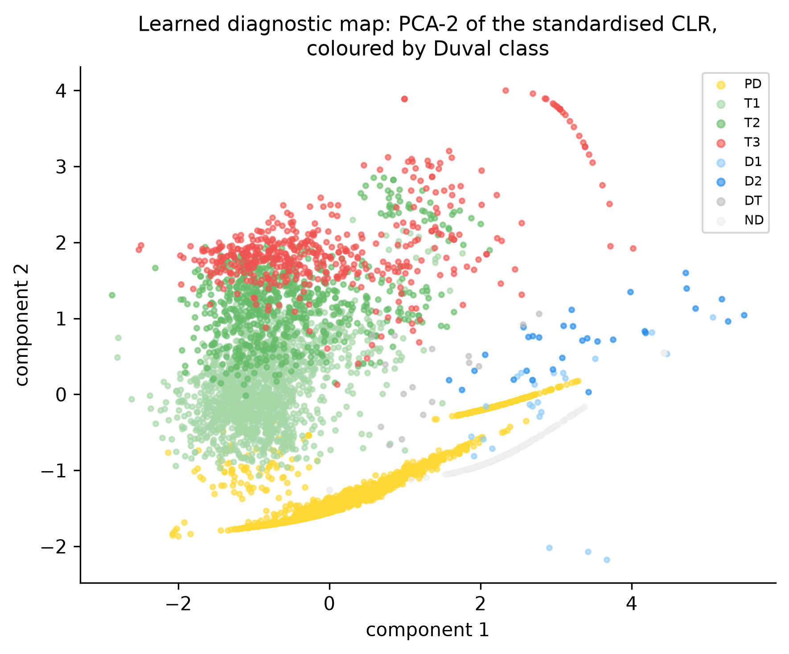
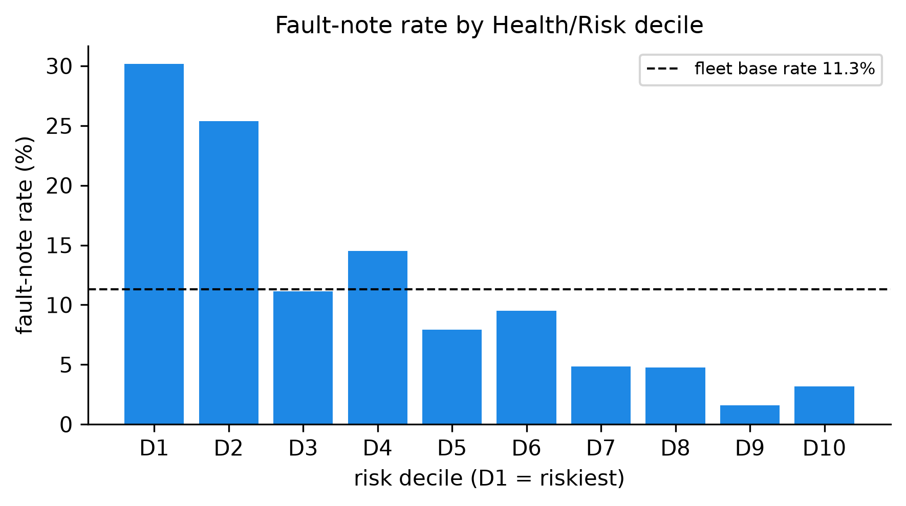

<!-- Source for Week5_Final_Report.pdf. Edit here, then re-export to PDF. Figures live in ../results/figures/. -->

**Executive summary.** Power transformers fail expensively, and Dissolved Gas Analysis (DGA) is the
standard way to catch faults early. Conventional interpretation (Duval, IEC, Rogers) is rule-based,
needs an expert, and machine-learning alternatives need fault labels that utilities rarely have.
On a real longitudinal fleet (628 units, 4,563 samples, 2019–2024) this project delivered three
results, all **label-free**. (1) Representing each sample by the **log-ratios of its gas
composition** separates fault *type* from gassing *severity* by construction: a simple linear
projection of that representation agrees with the expert Duval classes at **ARI 0.55, versus 0.16**
for raw concentrations — and a neural autoencoder adds nothing, a negative result we report.
(2) We discovered that the field-event notes routinely used to validate such models are **confounded
by surveillance bias**: simply counting how often a unit was sampled predicts logged events as well
as all our chemistry combined (AUC 0.76 vs 0.74, statistically indistinguishable). We quantify the
confound, repair part of it by translating the Thai field notes, and propose a confound-free,
chemistry-defined evaluation target. (3) A label-free **health/risk index** ranks the fleet usefully
(riskiest decile ≈ 27% event rate vs 2% for the safest), reported honestly against the confound floor.

## 1. Context and motivation

Power transformers are among the most critical and expensive assets of an electrical grid; an
in-service failure means outages, safety risk and costly, slow replacement. **Dissolved Gas Analysis
(DGA)** detects incipient faults early: internal thermal or electrical stress decomposes the oil and
paper insulation and releases characteristic gases (hydrogen, methane, ethylene, acetylene, carbon
oxides) measured in ppm. Conventional interpretation — IEC 60599 ratios, Rogers ratios and the Duval
Triangle — is **rule-based**, requires **expert judgement**, sometimes returns **"not determined"**,
and published machine-learning methods assume per-sample fault *labels* that utilities rarely have at
scale. In practice an operator must **prioritise maintenance across an entire fleet** — rank units by
risk — **without labels**. That is the gap this project addresses.

## 2. Objective, research question and dataset

**Research question.** Can we rank transformers across a fleet by incipient-fault risk and recover
fault types, *label-free*, from each unit's DGA history — and can we trust the way such models are
usually validated?

**Dataset.** 628 transformers, **4,563 main-tank oil samples**, 42 manufacturers, spanning
~5 years (2019–2024) at ~6-month sampling intervals (a genuinely **longitudinal** fleet), assembled
from multiple operational sources in Thailand and anonymised. **391 samples carry a free-text
field-event note** (Buchholz trip, bushing failure, high power factor...) — 69% of them partly in
Thai — used as **weak validation labels**, whose reliability itself became a finding of the project.

## 3. Week-by-week progress

| Week | Dates | Theme | Main outcome |
|------|-------|-------|--------------|
| 1 | 15–19 Jun | Foundations | Clean data + EDA, conventional baselines, literature (15+ refs with notes), problem statement; the "severity trap" identified |
| 2 | 22–26 Jun | Models + the discovery | Label-free risk index (AUC 0.74); research campaign reveals **surveillance bias** in the validation label (sample count: AUC 0.76); project reframed |
| 3 | 29 Jun–3 Jul | Attacking our own results | Linear CLR-PCA **beats** the neural model (ARI 0.545 vs 0.474); statistics hardened (unit-blocked intervals); 211 Thai notes translated; paper rewritten; git repository + dashboard |
| 4 | 6–10 Jul | Consolidation | Dashboard UX redesign; data-provenance statement; paper figures consolidated to the 6-page IEEE limit; defense decks (HTML + PowerPoint) |
| 5 | 13–17 Jul | Dissemination | Final report, cross-deliverable coherence audit, rehearsal, defense |

**Week 1 — Foundations.** Built and verified the full pipeline end-to-end on the real data: cleaning
(gas values stored as text, missing markers, field notes), exploratory analysis, and the conventional
baselines (Duval / IEC / Rogers) reproduced as the reference to compare against. A first experiment
already exposed the **severity trap**: a plain autoencoder on concentrations reaches near-perfect
cluster quality scores while agreeing with expert fault types at only ARI ≈ 0.015 — it had learned
*how much* gas, not *which fault*.

{width=66%}

**Week 2 — Models, and the discovery that reframed the project.** Built the label-free
**health/risk index** (gas severity + acetylene weighting + hydrogen growth rate + anomaly score;
AUC 0.74 against field events) and the compositional fault-type representation. Then a systematic
research pass produced the project's central finding: **how often a unit is sampled predicts logged
events as well as the chemistry does** (AUC 0.76) — because operators re-sample units they worry
about, the validation label partly records *attention*, not faults. This is surveillance /
informed-presence bias, well documented in medicine but, to our knowledge, never reported for DGA.
The project was reframed around it.

**Week 3 — Attacking our own results.** A full adversarial audit of our own headline claims.
Outcome 1: the fault-type gain comes from the **log-ratio geometry**, not the neural network — a
deterministic linear pipeline (CLR + PCA + KMeans) reaches **ARI 0.545 ± 0.002** vs Duval, beating
our own autoencoder (0.474 ± 0.055), which we demoted to a negative ablation. Outcome 2: honest
statistics everywhere — the 0.76-vs-0.74 gap is *not significant* (p = 0.58); the physics carries a
small real increment beyond the count (likelihood-ratio p = 0.003) but none forward in time; the
confound-free arcing-onset target rests on **17 onset units**, so we report unit-blocked confidence
intervals (ethylene AUC 0.64, CI 0.52–0.77 — above chance, modest). Outcome 3: all **211 distinct
Thai notes translated and classified** (+6 genuine electrical events); on the repaired label the
count's advantage disappears entirely (0.734 vs 0.735) — part of the confound was label
incompleteness. The paper was rewritten accordingly; the repository gained version control,
automated tests and an interactive dashboard.

{width=88%}

{width=62%}

**Week 4 — Consolidation.** Dashboard redesigned around scoring profiles (usable by a non-expert);
data-provenance statement finalised with the supervisor (anonymised multi-source records; an
anonymised extract is released with the code); paper figures consolidated into two multi-panel
figures to meet the 6-page IEEE limit; defense decks built (self-contained HTML + native PowerPoint).

**Week 5 — Dissemination.** This report, a cross-deliverable coherence audit (paper, decks, lab
notebook, dashboard, repository), rehearsal and defense.

## 4. Key results

{width=98%}

- **Fault-type recovery (contribution 1):** ARI **0.16 → 0.55** vs the Duval classes using log-ratio
  geometry and a linear projection; deterministic; stable on a strict temporal split (fit pre-2022,
  score 2022+: ARI 0.45). The neural variant (SD-CAE) and an adversarial disentanglement term are
  reported as **negative results**.
- **The validation caution (contribution 2):** sample count AUC **0.76** ≈ physics **0.74**
  (p = 0.58); forward validity falls to chance (0.50) once the count is controlled; a
  chemistry-defined target (arcing onset) remains genuinely predictable from gases (AUC 0.64,
  unit-blocked CI 0.52–0.77) while the count is not (0.49). **Recommendation to the field:** any DGA
  risk model validated on operator-logged events should co-report this sample-count confound floor.
- **Fleet ranking (contribution 3):** riskiest decile ≈ **27%** event rate vs ≈ **2%** for the
  safest; four transparent components (severity, acetylene, H2 growth rate, anomaly) — always read
  against the 0.76 floor above.

{width=72%}

## 5. Conclusion

The project set out to rank a transformer fleet by risk without labels; it delivered that — and
something arguably more valuable: evidence that **the standard way of validating such models is
partly measuring operator attention rather than transformer health**, plus a practical fix
(condition on the sampling count; use chemistry-defined targets; repair multilingual labels).
Methodologically, the strongest lesson is that **the right geometry beat the bigger model**: a
linear, interpretable, deterministic method outperformed our own neural network once the data was
represented correctly. All claims are reproducible: one command regenerates every number and figure
(10 automated tests), the paper draft (6-page IEEE format) is written, and an interactive dashboard
exposes the whole framework on an anonymised data extract.

## 6. Limitations and next steps

- **One fleet:** the surveillance-bias finding is demonstrated on this fleet; its prevalence across
  utilities is an open (and testable) question.
- **Weak labels remain weak:** the Thai-note classification awaits full domain validation; real
  failure/maintenance records would strengthen every risk claim.
- **Moderate absolute agreement:** ARI 0.55 is against a heuristic (Duval), not ground truth; we
  claim the relative gain and the label-free setting, not diagnostic accuracy.
- **Small-event statistics:** the chemistry target has 17 onset units; intervals are wide and
  reported as such.
- **Forward direction:** trajectory features in the compositional plane (an honest "temporal
  representation"), federated evaluation across utilities, and prognostics once better labels exist.

---

*Reproducible: every figure and number in this report is produced by versioned code
(`run_all.py` regenerates all of them). Repository: github.com/Thibaut0000/DGA_KMUTNB_2026_ThibautFCX
(private; anonymised data extract included). This is a research initiation (5 weeks, one student);
results are honestly hedged.*
