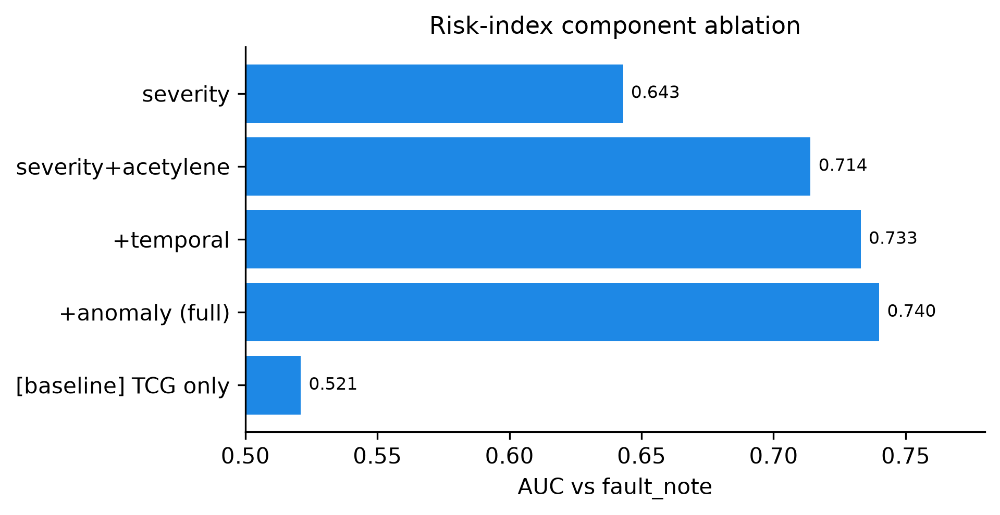

<!-- Source for Week5_Final_Report.pdf. Edit here, then re-export to PDF. Figures live in ../results/figures/. -->

**Executive summary.** Power transformers fail expensively, and Dissolved Gas Analysis (DGA) is the
standard way to catch faults early. Conventional interpretation (Duval, IEC, Rogers) is rule-based,
needs an expert, and does not scale to a whole fleet without labels. This project developed a
**label-free, self-supervised** framework that **ranks a fleet of transformers by incipient-fault
risk** from their DGA history, and explains each rank by separating fault *type* from *severity*.
On a real longitudinal fleet (628 units, 4,563 samples, ~4.5 years), the label-free risk ranking
reaches **AUC 0.74** against recorded field events (vs 0.52 for a total-gas baseline), and the
compositional representation **triples** the agreement with expert fault types (ARI 0.14 to 0.47).

## 1. Context and motivation

Power transformers are among the most critical and expensive assets of an electrical grid; an
in-service failure means outages, safety risk and costly, slow replacement. **Dissolved Gas Analysis
(DGA)** detects incipient faults early: internal thermal or electrical stress decomposes the oil and
paper insulation and releases characteristic gases (hydrogen, methane, ethylene, acetylene, carbon
oxides) measured in ppm. Conventional interpretation methods — IEC 60599 ratios, Rogers ratios and
the Duval Triangle — are **rule-based**, require **expert judgement**, sometimes return
**"not determined"**, and implicitly assume a per-sample fault *label* that utilities rarely have at
scale. In practice an operator must **prioritise maintenance across an entire fleet** — rank units by
risk — **without labels**. That is the gap this project addresses.

## 2. Objective, research question and dataset

**Research question.** Can we rank transformers across a fleet by incipient-fault risk, *label-free*,
by learning a self-supervised, temporal representation of each unit's DGA history and scoring severity
and deviation (acetylene-aware) — and how does this compare with conventional DGA interpretation?

**Dataset.** 628 transformers, **4,563 main-tank oil samples**, 42 manufacturers, 115–525 kV, spanning
a median ~4.5 years at ~6-month sampling intervals (a genuinely **longitudinal** fleet). **391 samples
carry a real field-event note** (Buchholz trip, bushing failure, high power factor...), used as
**weak validation labels** — sparse and imperfect, so results are read as indicative, not absolute.

## 3. Approach

The pipeline turns each unit's raw DGA history into a single risk rank, with no fault labels used at
any stage, and is benchmarked against the conventional methods.

{width=98%}

## 4. Week-by-week progress

| Week | Dates | Theme | Main outcome |
|------|-------|-------|--------------|
| 1 | 15–19 Jun | Foundations | Clean data + EDA, conventional baselines, literature (16 refs + notes), problem statement |
| 2 | 22–26 Jun | Representation learning | AE + VAE; compositional representation separating fault type from severity (ARI 0.14 to 0.47) |
| 3 | 29 Jun–3 Jul | Clustering + anomaly detection | Fault-family clusters + anomaly scoring, validated against field-event notes |
| 4 | 6–10 Jul | Health/risk index + evaluation | Label-free fleet ranking, AUC 0.74; systematic comparison vs conventional methods |
| 5 | 13–17 Jul | Writing + dissemination | IEEE paper draft, frozen figures/tables, reproducible repository, defense slides |

**Week 1 — Foundations.** Built and verified the full pipeline end-to-end on the real data: cleaning
(gas values stored as text, missing markers, field notes), exploratory analysis, and the conventional
baselines (Duval / IEC / Rogers) reproduced as the reference to compare against. The literature review
produced 16 references with per-paper reading notes. The fleet is dominated by partial-discharge and
thermal diagnoses, with a strong class imbalance to keep in mind for evaluation.

{width=66%}

**Week 2 — Representation learning.** Trained and tuned an autoencoder and compared a variational
autoencoder. The key experiment separated **magnitude** (total gas = severity) from **composition**
(gas proportions = fault type). Encoding only the composition (a CLR transform) raised agreement with
Duval fault types from **ARI 0.14 to 0.47** (about ×3.4, over 5 seeds) and removed severity leakage
(R² 0.63 to 0.27). An adversarial variant did **not** help — a negative result reported honestly.

{width=90%}

The chosen representation shows real fault-type structure — discharge, thermal and partial-discharge
samples fall in different regions:

{width=62%}

**Week 3 — Clustering and anomaly detection.** Clustered the representation (KMeans / GMM / HDBSCAN,
model selection by silhouette) and interpreted each cluster physically against the Duval mix. Added
anomaly scoring by autoencoder reconstruction error and Isolation Forest, and validated flagged
anomalies against the field-event notes (precision/recall reported as indicative given weak labels).

**Week 4 — Health/risk index and evaluation.** Combined severity, an **acetylene weighting**
(acetylene = arcing = the most dangerous fault), a **temporal** gas-growth-rate feature, and the
anomaly score into a single **label-free Health/Risk Index**, then ranked the fleet. Each component
adds measurable value, and the full index reaches **AUC 0.74** against field events, far above a
total-gas baseline (0.52).

{width=72%}

**Week 5 — Writing and dissemination.** Drafted the IEEE paper (all sections), froze the figures and
tables under `results/`, finalised the reproducible repository, and prepared the defense slides.

## 5. Key results

The ranking is **meaningful**: the 10% riskiest units carry far more real field faults (~30%) than
the fleet average (~11%) and than the safest units (~2–3%), with a monotonic trend across deciles.

{width=78%}

- **Representation:** fault-type agreement tripled (ARI 0.14 to 0.47); severity leakage removed.
- **Risk ranking:** AUC 0.74 vs 0.52 baseline; monotonic risk deciles; top-decile lift up to ×2.7.
- **Component value:** severity 0.64 to +acetylene 0.71 to +temporal 0.73 to +anomaly 0.74.
- **Vs conventional:** the label-free ranking recovers the units the conventional severity ordering
  flags, and surfaces some the rules miss — while needing no labels and no expert thresholds.

## 6. Conclusion

The project delivered a **label-free, self-supervised framework** that ranks a real fleet of
transformers by incipient-fault risk, and explains each rank by separating fault *type* (a
compositional representation) from *severity* (an acetylene-aware risk score). Three contributions
stand out: (1) the label-free fleet health-ranking pipeline, validated on a longitudinal fleet;
(2) a compositional representation that recovers fault type and provides the interpretable "why"
behind a rank; (3) a systematic comparison with the conventional IEC / Duval / Rogers methods.
Because no ground-truth health label exists, the ranking is validated **indirectly** (field-event
notes + agreement with C57.104 severity), and the framework is positioned as **decision support**,
not a claim to beat supervised classifiers (a different setting). In short, it turns DGA from a
per-sample rule lookup into a **fleet-level, label-free maintenance-prioritisation tool**.

## 7. Limitations and next steps

- **Weak, sparse labels** (391 field-event notes) → validation is indicative; we report note-rate by
  decile and precision@k rather than a single accuracy number.
- **Temporal features are engineered** (gas-growth rates); a deep sequence model over each unit's
  trajectory is the natural next step.
- **Confound control:** the index deliberately uses physical-gas features only (not sampling
  frequency, which correlates with faults only because faulted units get re-sampled).
- **Highest-leverage improvement:** a better label — translating the Thai field notes or obtaining the
  utility's failure records — would strengthen every risk claim.
- **Forward direction** (consistent with the 2026 review literature): deep temporal models, Deep SVDD
  anomaly detection, digital-twin remaining-useful-life prognostics, and privacy-preserving federated
  learning across utilities.

---

*Reproducible: every figure and number is produced by code under `results/`. This is a research
initiation (5 weeks, one student); results are early and honestly hedged.*
