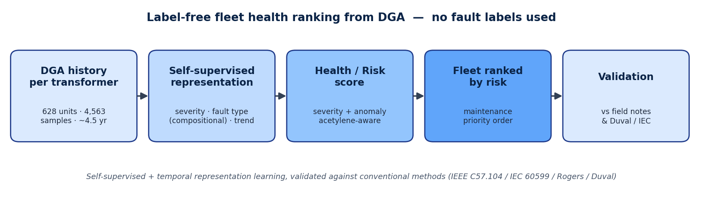
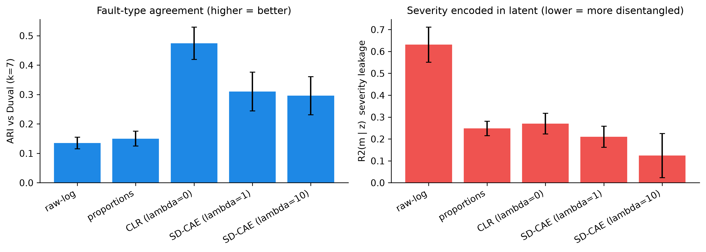

## 1. The project in one paragraph

Power transformers are expensive, critical machines. **Dissolved Gas Analysis (DGA)** is like a
blood test of the insulating oil: when a transformer has an early fault, it produces specific gases.
Today engineers read these gases with fixed rules (Duval, IEC, Rogers). These rules need an expert,
sometimes give "no answer", and do not scale to a whole fleet. **My project ranks a whole fleet of
transformers by risk, without any fault labels** — the computer learns the patterns by itself
(*self-supervised*) and uses the history of each unit over time (*temporal*). I then compare this
ranking with the conventional methods.

{width=98%}

## 2. What I understood

- **The data has no labels and is longitudinal.** 628 transformers, 4,563 oil samples, ~4.5 years,
  ~7 samples per unit. We do not know the "true" fault, so supervised learning is not realistic —
  the right goal is to **rank** units by risk.
- **Each gas has a meaning.** Hydrogen = partial discharge; methane/ethane = low-temperature heating;
  ethylene = high-temperature heating; **acetylene = arcing = the most dangerous**; CO/CO₂ = paper damage.
- **Conventional methods are a baseline, not the truth.** Running Duval on the fleet gives mostly
  partial-discharge and thermal faults, with a strong class imbalance and some "not determined" cases.
- **The key question:** can a model rank the riskiest units — and does it capture the fault *type*,
  or only the overall *severity* (how much gas)?

{width=70%}

## 3. What I did (Week 1)

- **Built the full project and pipeline** (data cleaning → preprocessing → conventional baselines →
  autoencoder → clustering → anomaly detection → evaluation). It runs end-to-end and is reproducible.
- **Read the 5 key papers** and organised the references.
- **Got two main results:**

**Finding 1 — the model can separate fault *type* from *severity*.**
A plain autoencoder mostly captures *how much* gas there is (severity), not *which* fault it is.
Using the gas **composition** (proportions) instead makes the model agree far better with Duval fault
types: agreement score **ARI 0.14 → 0.47**.

{width=92%}

**Finding 2 — the label-free risk ranking works.**
I built a risk score (severity + anomaly + **acetylene** weighting + time trend) and ranked the fleet.
The **10% riskiest units have ~30% real fault-events**, versus the **11.3% fleet average** and only
**~2–3%** for the safest units. Overall **AUC = 0.74** (a simple TCG-only baseline = 0.52).

{width=80%}

## 4. What I plan to do (Weeks 2–5)

- **Weeks 2–3:** finish the per-unit *temporal* features and the full health/risk index; add a stronger
  anomaly method (Deep SVDD).
- **Week 4:** systematic comparison of my ranking against C57.104 / IEC / Rogers / Duval; show the
  units the rules miss; freeze the results and figures.
- **Week 5:** write the IEEE paper and prepare the defense.
- **Open question to settle:** how much the temporal (time-trend) information improves the ranking —
  early result is a small but positive gain.

## 5. Document analysis (the references I am using)

A one-line note on each key source, with what it contains:

- **Ramarao et al. 2026 — review (34 pages).** A survey of DGA diagnostics from classic rules to AI;
  gives the big picture and shows where my approach fits. *My main related-work map.*
- **Saleh et al. 2026.** A recent method that combines the classic rules with machine learning to
  classify faults (~99% accuracy, but it needs labelled data). *My state-of-the-art comparison.*
- **Wang et al. 2016.** Uses an autoencoder to learn features from gas data — the closest existing
  idea to mine, but it still ends with a labelled classifier.
- **Liu et al. 2020.** Groups transformers by fault using density clustering on gas proportions —
  the closest existing "no-label grouping" work.
- **Duval 2002.** Defines the Duval Triangle and the fault types (partial discharge, thermal,
  arcing) — the expert rule I compare against.
- **IEEE C57.104-2019 (standard).** Says when gas levels are "normal" using statistical limits —
  the basis for my severity / anomaly thresholds.
- **IEC 60599:2022 (standard).** The source of the gas-ratio rules (cited; not needed in full).

---

*All numbers are produced by code and saved under `results/`; nothing is hand-typed. This is a Week-1
status — results are early and validated indirectly (no ground-truth health label exists).*

---

## Appendix — the pipeline in code (one line per step)

*Just to show that each step above is a short, reproducible piece of code. No need to read the code in
detail — the plain-English line under each box says what it does. (Imports are omitted for clarity.)*

**1. Clean the data**
```python
df = data.load_clean()
```
Reads the 4,563 oil-test samples, fixes the formats, and marks the rows that carry a field-event note.

**2. Prepare the data**
```python
fm = preprocessing.build_feature_matrix(df, cfg)
```
Puts the gas values on a comparable scale so the model can use them.

**3. Conventional baseline**
```python
diag = conventional.diagnose(df)        # the classic Duval / IEC / Rogers expert rules
```
Applies the standard expert rules — this is what we compare our method against.

**4. Self-supervised model**
```python
res = train_autoencoder(fm.X, cfg.autoencoder)   # the model learns gas patterns by itself
Z   = res.model.encode(fm.X)                      # a short "summary" of each sample
```
A small neural network learns the patterns on its own, with no labels, and summarizes each sample.

**5. Grouping (clustering)**
```python
cl = clustering.fit(Z, cfg.clustering)
```
Automatically groups similar transformers into families.

**6. Anomaly detection**
```python
scores = anomaly.reconstruction_scores(res.model, fm.X)   # how unusual each sample is
flags  = anomaly.threshold_flags(scores, 0.95)            # flag the most unusual 5%
```
Flags the most unusual samples — the candidate early faults.

**7. Evaluation**
```python
evaluation.external_metrics(cl.labels, diag["duval"])     # our groups vs the expert diagnosis
```
Checks whether the model's groups match the conventional expert diagnosis.

> In short: the whole method is only a handful of short, transparent, reproducible code steps.
