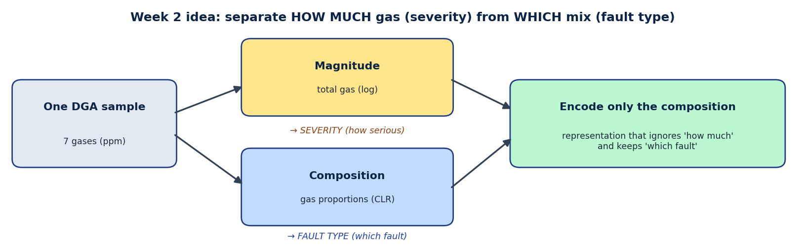
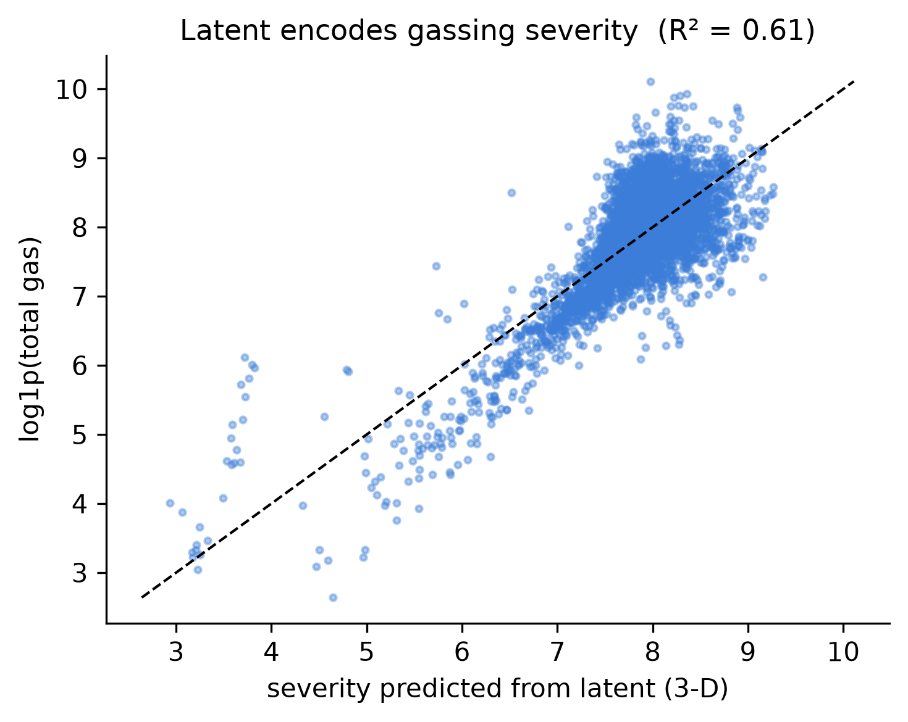
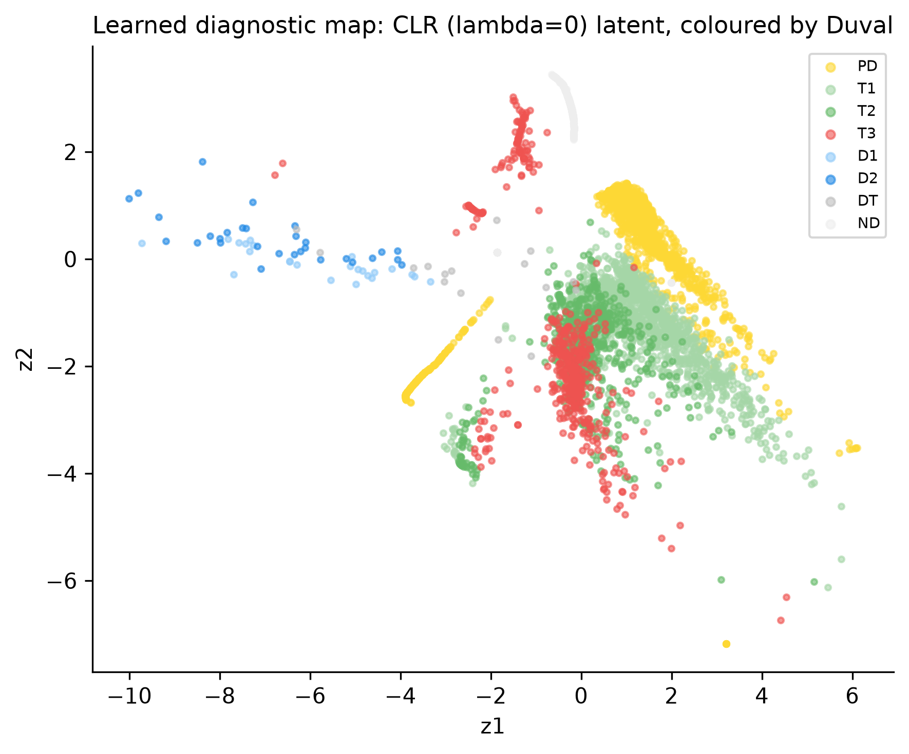

## 1. This week in one paragraph

Week 2 was about **representation learning** — teaching the model to summarise each oil sample into a
few numbers, and, crucially, to make those numbers capture the **fault type** (which fault), not just
the **severity** (how much gas). I trained and tuned the autoencoder, compared a variational
autoencoder (VAE), and ran the key experiment of the project: separating "how much" from "the mix".

{width=98%}

## 2. The problem from Week 1

The plain autoencoder mostly learned **severity** — the overall amount of gas — not the fault type.
The plot below shows it: the representation predicts total gas almost perfectly (R² = 0.61). That is
useful for "how serious", but it cannot tell partial discharge from thermal from arcing. The fix
(already in the plan): fault type lives in the **proportions** of the gases — exactly what the Duval
rule uses — so the model should look at proportions, not raw amounts.

{width=58%}

## 3. What I did (Week 2)

- **Trained and tuned the autoencoder** (different sizes and numbers of summary dimensions); checked
  training curves and reconstruction quality.
- **Implemented and compared a VAE** (a probabilistic autoencoder). The simpler compositional
  autoencoder gave the clearer, more interpretable separation, so I selected it.
- **Key experiment — separate magnitude from composition.** I described each sample by its gas
  **proportions** (a standard transform, CLR) and encoded only those — removing "how much" and
  keeping "which mix".
- **Result:** agreement with the Duval fault types **more than tripled** — from **ARI 0.14** (raw
  amounts) to **0.47** (proportions), averaged over 5 runs — and severity stopped leaking into the
  representation (R² 0.63 → 0.27).
- **Honest check (negative result):** I also tried an "adversarial" trick to force type and severity
  apart. It **did not help**, so the gain comes from the proportions idea itself, not the trick —
  reported as such.
- **Froze the chosen representation** and drafted the method section.

{width=92%}

The chosen representation now shows real **fault-type structure** — discharge (blue), thermal
(green/red) and partial-discharge (yellow) samples fall in different regions:

{width=62%}

> **On credibility:** ARI measures **agreement with an expert rule (Duval)**, not accuracy against a
> true label — we have none. The honest claim is the **large relative gain (×3.4)** and the removal of
> severity leakage, not a perfect score. Rare fault classes (D1/D2) stay hard, as expected.

## 4. What I plan to do (Week 3)

Following the plan: take this representation into **clustering** (group the fleet into fault families)
and **anomaly detection** (flag unusual samples), and **evaluate both quantitatively** — internal
cluster quality, agreement with Duval, and checking flagged anomalies against the real field-event
notes.

---

*All numbers are produced by code and saved under `results/` (`results/tables/sdcae_ablation.csv`);
nothing is hand-typed. Week-2 status — the representation is frozen; clustering and anomaly
evaluation come next.*
